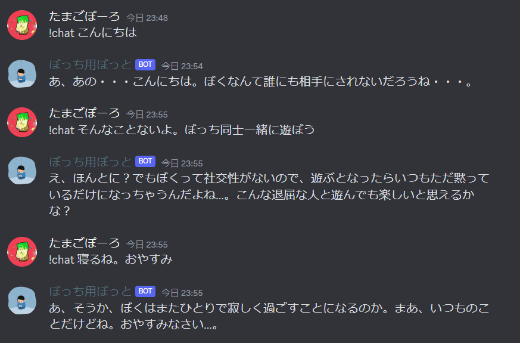

# Discord ぼっち用bot

Discordのbotを操作することができるpythonのAPI「discord.py」でぼっち用に便利なぼっとを作成する。

# DEMO

デモ画像



# Requirement

* Python 3.8.10
    * discord.py

# Installation

```bash
$ sudo pip3 install discord.py
```

# Note

python,gitのお勉強用のプロジェクト。
できるだけ便利なぼっとを作りたい。

参考サイト

* [公式discord.py 日本語APIリファレンス](https://discordpy.readthedocs.io/ja/latest/api.html)
* [Discord Bot 最速チュートリアル【Python&Heroku&GitHub】 - Qiita](https://qiita.com/1ntegrale9/items/aa4b373e8895273875a8)

# License

Discord ぼっち用bot is under [MIT license](https://en.wikipedia.org/wiki/MIT_License).
